### Bowdoin Glacier, GL  <!-- .element style="top: 1em" -->

<!-- .slide: data-background-image="https://live.staticflickr.com/65535/49298829236_2546afe01d_k.jpg" -->

---

# Towards global mountain paleoglacier and   biome connectivity modelling

 

**Julien Seguinot & Suzette Flantua**, 9 June 2022

https://mountainsinmotion.w.uib.no

---

### Paleoglacier modelling  <!-- .element style="top: 1em" -->

<!-- .slide: data-background-iframe="https://player.vimeo.com/video/294517816?autoplay=1&loop=1&color=ffffff&title=0&byline=0&portrait=0#t=45s" -->

---

### Biome connectivity

